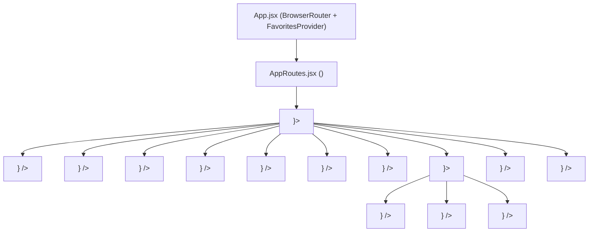

# Orchid Router SPA — Route Map & Architectural Specification

**Student Name:** Võ Anh Hào  
**Student ID:** CE191463  
**Course:** SBA301 (Slot 10: React Router & Single Page Application Architecture)  
**Project:** Orchid Router SPA  
**Workspace:** `C:\SBA301\labs\slot10`  

---

## 1. Route Tree Architecture (Mermaid Diagram)

The routing structure follows a clean hierarchical pattern declared in `src/routes/AppRoutes.jsx` under a single top-level `BrowserRouter` (mounted in `src/App.jsx`):

---

## 2. Comprehensive Route Matrix (Bảng chi tiết các Route thực tế)

| URL Pattern | Component | Parent Layout | Parameters / Query | Purpose & Description |
| :--- | :--- | :--- | :--- | :--- |
| `/` | `HomePage.jsx` | `MainLayout` | None (index route) | **Landing Showcase:** Hero banner, SPA vs MPA concepts, spotlight featured orchids. Navbar "Home" link receives `.active-nav` (matched via `end` prop). |
| `/orchids` | `OrchidsPage.jsx` | `MainLayout` | `?category=[CategoryName]` *(optional)* | **Catalog Listing & Filter:** Displays 10 orchid species. Reads/writes filter state via `useSearchParams()`. Empty state alert if no orchids match. |
| `/orchids/:id` | `OrchidDetailPage.jsx` | `MainLayout` | `:id` *(dynamic path parameter)* | **Orchid Specifications View:** Trích xuất `:id` qua `useParams()`. Hiển thị ảnh lớn, bảng thông số (watering, light, origin, season), và các loài liên quan. Xử lý "Resource Not Found" nếu ID không tồn tại. |
| `/about` | `AboutPage.jsx` | `MainLayout` | `?submitted=true` *(optional feedback)* | **About & Educational Documentation:** Explains SPA architecture, client routing concepts, and displays submission alert when redirected from Contact. |
| `/contact` | `ContactPage.jsx` | `MainLayout` | None | **Contact & Programmatic Navigation Demo:** Simulated inquiry form with client validation. Demonstrates `useNavigate()` with standard push vs `{ replace: true }`. |
| `/exercises` | `ExercisesPage.jsx` | `MainLayout` | None | **Interactive Exercise Workbook:** Hub presenting 10 interactive hands-on exercises covering all core topics of Chapter 09. |
| `/location-demo` | `LocationDemoPage.jsx` | `MainLayout` | `?species=...#hash` *(dynamic)* | **Live Location Inspector:** Visualizes real-time properties of the `useLocation()` hook (`pathname`, `search`, `hash`, `state`, `key`). |
| `/dashboard` | `DashboardHomePage.jsx` | `DashboardLayout` inside `MainLayout` | None (index subroute) | **Dashboard Overview:** Displays aggregated botanical statistics (total species, categories, favorites count) inside `DashboardLayout` via `<Outlet />`. |
| `/dashboard/favorites` | `FavoritesPage.jsx` | `DashboardLayout` inside `MainLayout` | None (child subroute) | **Bookmarked Favorites:** Manages user favorites backed by reactive Context & `localStorage`. Renders inside `<Outlet />` without re-rendering the sidebar. |
| `/dashboard/profile` | `ProfilePage.jsx` | `DashboardLayout` inside `MainLayout` | None (child subroute) | **Student Identity View:** Displays mock academic credentials for student Võ Anh Hào (CE191463) demonstrating nested route integration. |
| `/home` | `<Navigate to="/" replace />` | `MainLayout` | None | **Legacy Route Redirect:** Tự động chuyển hướng từ `/home` về `/` bằng component `Navigate` với cờ `replace`, tránh tạo vòng lặp trong lịch sử duyệt web. |
| `*` | `NotFoundPage.jsx` | `MainLayout` | Any unmatched path *(wildcard)* | **Wildcard 404 Handler:** Catches all undefined paths, displays the attempted URL via `useLocation().pathname`, and provides navigation links back to Home and Orchids. |

---

## 3. Core Architectural Concepts & React Router Hooks Explained

### 1. `MainLayout` (Root Application Chrome)
- **Mục đích:** Cung cấp khung bao bọc giao diện chung cho toàn bộ ứng dụng (Top Navbar `AppNavbar`, container nội dung chính và Footer).
- **Vị trí:** Được khai báo tại `<Route path="/" element={<MainLayout />}>`. Mọi trang trong ứng dụng đều được render bên trong `MainLayout` thông qua thẻ `<Outlet />`.

### 2. `DashboardLayout` (Nested Layout)
- **Mục đích:** Tạo ra cấu trúc giao diện lồng nhau 2 cột (Master-Detail Layout) cho khu vực quản trị: Cột trái là thanh điều hướng con (Dashboard Sidebar Menu), cột phải là vùng nội dung thay đổi linh hoạt.
- **Lợi ích:** Khi người dùng chuyển đổi giữa các tab `/dashboard`, `/dashboard/favorites`, `/dashboard/profile`, component `DashboardLayout` không bị unmount/re-render; chỉ có component con được nạp vào vùng `<Outlet />`.

### 3. `<Outlet />` (Child Route Mounting Slot)
- **Mục đích:** Là một thành phần của React Router đóng vai trò là **"cổng cắm / vị trí giữ chỗ" (placeholder)** trong component cha. Khi một route con khớp với URL, component của route con đó sẽ được hiển thị ngay tại vị trí đặt `<Outlet />`.

### 4. `<Navigate to="..." replace />` (Declarative Redirect)
- **Mục đích:** Thực hiện chuyển hướng tự động ngay khi component được render. Thuộc tính `replace` đảm bảo rằng đường dẫn cũ (ví dụ `/home`) được ghi đè trực tiếp lên entry hiện tại trong browser history stack thay vì thêm mới, giúp người dùng khi bấm nút "Back" trên trình duyệt không bị kẹt trong vòng lặp chuyển hướng.

### 5. `useParams()` (Dynamic Path Parameters Hook)
- **Mục đích:** Trích xuất các tham số động từ đường dẫn URL (ví dụ trích xuất `id` từ `/orchids/:id`). Trả về một object với key khớp với tên token khai báo trong Route (`params.id`).

### 6. `useSearchParams()` (Query String Synchronization Hook)
- **Mục đích:** Đọc và cập nhật các tham số truy vấn sau dấu chấm hỏi (ví dụ `?category=Vanda`). Cho phép đồng bộ trạng thái lọc với URL, giúp người dùng có thể sao chép liên kết chia sẻ hoặc lưu bookmark mà không làm mất bộ lọc.

### 7. `useNavigate()` (Imperative / Programmatic Navigation Hook)
- **Mục đích:** Cho phép lập trình viên điều hướng người dùng bằng code JavaScript (sau khi submit form, kiểm tra xác thực, hết giờ). Hỗ trợ cả cơ chế `navigate('/path')` (push) và `navigate('/path', { replace: true })`.

### 8. `useLocation()` (Current URL Inspection Hook)
- **Mục đích:** Trả về đối tượng `location` hiện tại của trình duyệt, cung cấp chi tiết: `pathname` (đường dẫn), `search` (query string), `hash` (anchor `#`), `state` (dữ liệu truyền ngầm trong bộ nhớ), và `key` (định danh duy nhất của mỗi bước lịch sử).

---

## 4. Phân biệt then chốt: Resource Not Found vs Wildcard 404

Một trong những kiến thức quan trọng nhất của bài học là phân biệt rõ 2 loại lỗi "không tìm thấy":

| Tiêu chí | Resource Not Found (`/orchids/999999`) | Wildcard Route 404 (`/unknown-path`) |
| :--- | :--- | :--- |
| **Bản chất lỗi** | **Lỗi dữ liệu nghiệp vụ (Data Lookup Failure)** | **Lỗi định tuyến (Routing Pattern Mismatch)** |
| **Khớp Route?** | **CÓ khớp** mẫu `<Route path="orchids/:id" ... />` | **KHÔNG khớp** bất kỳ route nào được khai báo |
| **Component được mount** | `OrchidDetailPage.jsx` | `NotFoundPage.jsx` |
| **Cơ chế phát hiện** | Đoạn code logic trong component: `const orchid = getOrchidById(id); if (!orchid) { ... }` | React Router duyệt hết bảng định tuyến và rơi vào route dự phòng cuối cùng: `<Route path="*" ... />` |
| **Xử lý chuẩn** | Hiển thị thông báo thân thiện: "Không tìm thấy hoa lan có mã 999999 trong danh mục" kèm nút quay về danh sách. | Hiển thị màn hình 404 "Page Not Found", hiển thị pathname không hợp lệ và cung cấp liên kết về Trang chủ. |

---

## 5. Bản chất dữ liệu (Data Nature Notice)

- **Dữ liệu tĩnh / Mock Data:** Ứng dụng hoạt động hoàn toàn ở phía Frontend Client-side (SPA). Toàn bộ danh mục hoa lan gồm 10 loài thuộc 4 chi được khai báo tĩnh trong tập tin `src/data/orchids.js`.
- **Không kết nối Backend:** Dự án Slot 10 tập trung chuyên sâu vào React Router và kiến trúc SPA; chưa tích hợp máy chủ Spring Boot hay cơ sở dữ liệu SQL.
- **Độc lập với Lab 02:** Dự án được thiết kế độc lập, không phụ thuộc và không chứa mã nguồn của Lab 02.
